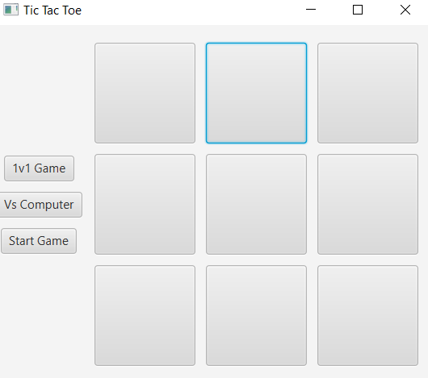
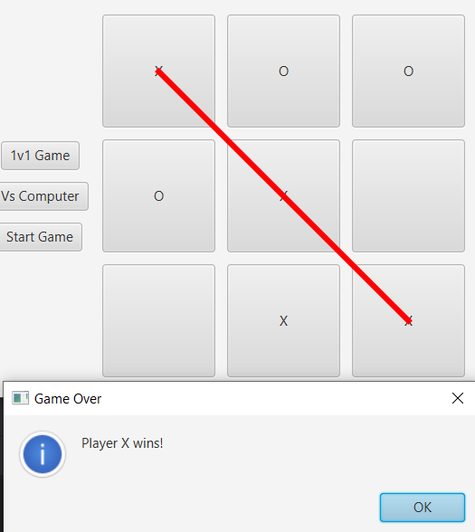

# Tic Tac Toe
## Overview
A simple and interactive Tic Tac Toe game built using JavaFX. The game supports both player vs player and player vs computer modes.

## Features
- Play TicTacToe in two modes: Player vs Player and Player vs Computer.
- Computer AI uses the Minimax algorithm to make optimal moves.
- Displays the winning line when a player wins.
- Provides alerts to announce the winner or if the game is a draw.

## Requirements
- Java Development Kit (JDK) 8 or higher.
- JavaFX SDK.

## Gameplay Modes
- Player vs Player: Two players take turns to place their marks (X and O) on the grid.
- Player vs Computer: Play against the computer which uses the Minimax algorithm to make optimal moves. 

## Game Rules
- The game is played on a 3x3 grid.
- Players take turns to place their marks (X or O) in an empty cell.
- The first player to get 3 of their marks in a row (horizontally, vertically, or diagonally) wins.
- If all 9 cells are filled and neither player has 3 marks in a row, the game is a draw.

## Code Structure
- TicTacToe.java: Main application file containing the game logic and GUI setup.
  - start(Stage primaryStage): Initializes the primary stage.
  - createGridPane(): Creates the grid pane for the TicTacToe board.
  - createButton(): Creates a single button for the board.
  - createButtonPane(): Creates the pane with control buttons.
  - handleButtonClick(Button button): Handles the click events on the board buttons.
  - checkForWinner(): Checks if there is a winner.
  - resetGame(): Resets the game board for a new game.
  - makeComputerMove(): Makes a move for the computer using the Minimax algorithm.
  - minimax(int depth, char player): Minimax algorithm to find the best move for the computer.

## Demonstration

